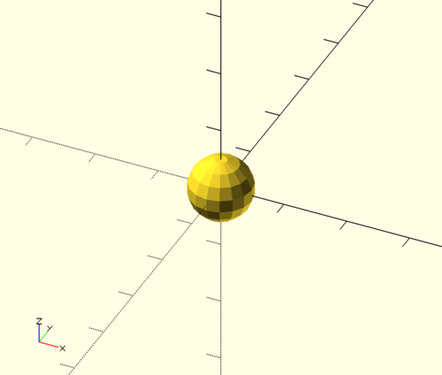
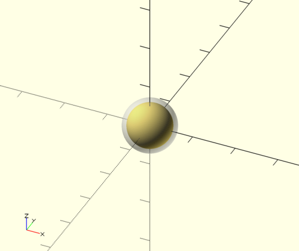
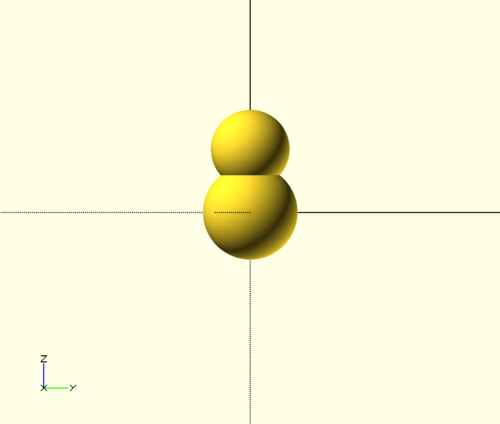
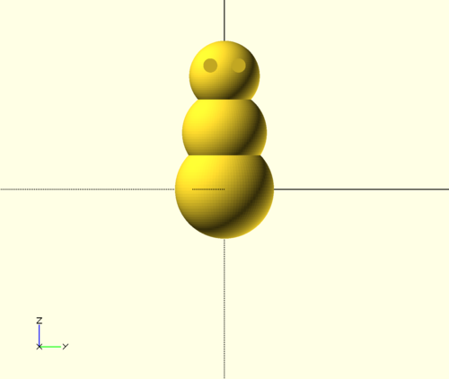
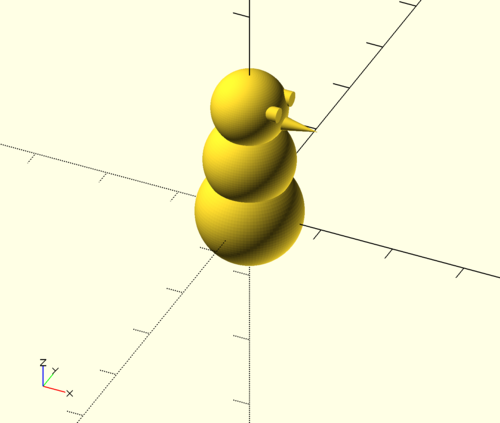
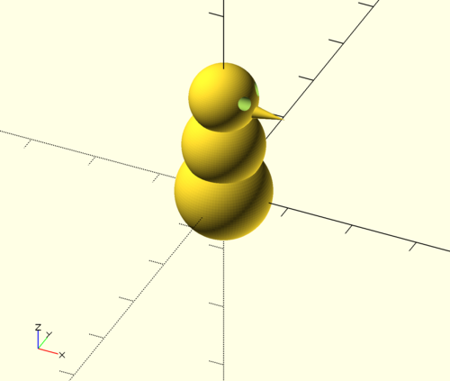
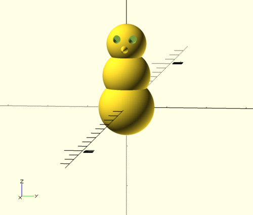

# <center>OpenSCAD</center>

[OpenSCAD](http://www.openscad.org/) è un linguaggio di programmazione che permette di creare dei modelli 3D geometricamente precisi usando una serie di comandi concatenabili.

+ Tutte le misurazioni avvengono in millimetri.
+ Tutte le righe di codice devono terminare con `;`, `{` o `}`.
+ La parte decimale dei numeri è separata da quella intera con un punto (`.`).
+ Per aggiornare il modello visualizzato premere `F5` e per compilarlo `F6`.

Un comodo elenco stampabile dei comandi disponibili è situato a questo indirizzo: [http://www.openscad.org/cheatsheet/index.html](http://www.openscad.org/cheatsheet/index.html)

## Occorrente

+ [Software OpenSCAD](http://www.openscad.org/downloads.html) - (Windows, Mac OS, Linux, BSD, compilazione da sorgente)
+ Un PC
    + Non è necessaria né una grande potenza di calcolo né una grande scheda grafica per i primi esperimenti. Le performance incideranno solo sui tempi di compilazione del modello finale.

## Esperimento 1 - Pupazzo di neve (corpo)

### Funzioni usate

+ `sphere(r)`
+ `translate([x, y, z])`

### Procedimento

1. Creazione di tre sfere con raggi crescenti.
2. Traslazione delle due sfere più piccole verso l’alto.

---

La funzione `sphere()` accetta [diversi parametri](https://en.wikibooks.org/wiki/OpenSCAD_User_Manual/The_OpenSCAD_Language#sphere), tra cui il raggio `r` della sfera, il suo diametro `d`, e il numero di facce `$fn`.

> Anche altri parametri più avanzati possono essere specificati: la wiki ufficiale ([https://en.wikibooks.org/wiki/OpenSCAD_User_Manual/](https://en.wikibooks.org/wiki/OpenSCAD_User_Manual/)) contiene tutta la documentazione necessaria.

Per creare una sfera di raggio 5mm:

```openscad
sphere(r=5);
```

<center></center>

In OpenSCAD i parametri possono essere specificati in due modi:

+ Usando la notazione `nomeParametro=valore`. In questo modo non è necessario ordinarli in modo particolare.
+ Usando la notazione `valore`. Non specificando il nome del parametro sarà però necessario disporlo in ordine di successione come la documentazione indica. Per `sphere`, ad esempio, sarebbe `sphere(r, d, $fa, $fs, $fn)`.

Come è facile notare la sfera non è particolarmente uniforme: per renderla tale ne si deve aumentare la risoluzione (in questo caso il numero di facce). Per fare ciò, cambiare la riga appena scritta con questa:

```openscad
sphere(5, $fn=100);
```

<center></center>

Ricordarsi che più sarà alto il numero di facce - in questo caso ne useremo 100 - più sarà lungo il processo di compilazione finale dell'oggetto e più sarà grande il file risultante!

> Qui si può anche notare come il nome `r` del parametro _raggio_ sia stato omesso, in quanto è anche nella documentazione il primo parametro: il software riconosce la sua posizione e assume che si tratti proprio del raggio `r`. Dovendo specificare anche il numero di facce `$fn`, ma non volendo fornire anche tutti gli altri parametri che ci sono tra `r` e `$fn` (`d`, `$fa` e `$fs`), quest'ultimo viene specificato col suo nome: `$fn=100`.

Creiamo adesso una sfera più grande, aggiungendo questa linea subito dopo quella già scritta:

```openscad
sphere(6, $fn=100);
```

**Come mai non si vede più la sfera più piccola?** Questo perchè tutti gli oggetti vengono creati centrati sull'origine degli assi cartesiani del progetto, e la sfera più grande ha "inglobato" quella più piccola. In realtà quest'ultima è solamente nascosta da quella più grande ma rimane un'entità completamente distinta. Questo meccanismo può essere verificato prependendo `%` all'ultima riga scritta, un modificatore che rende semitrasparente il risultato della riga a cui viene preposto _(più informazioni sui modificatori e sui loro effetti sono disponibili nella documentazione completa)_.

<center></center>

Per risolvere il problema si deve traslare una delle due sfere: o si sposta quella grande verso il basso o si sposta quella piccola verso l'alto. Per fare ciò si usa la funzione `translate`, che prende come parametro un _vettore di coordinate_; un _VdC_ è un insieme di coordinate X, Y e Z racchiuso tra parentesi quadre ed indica uno spostamento dall'origine degli assi.

In questo caso, per spostare la sfera piccola più in alto, il codice diventerebbe:

```openscad
translate([0, 0, 8]) sphere(5, $fn=100);
sphere(6, $fn=100);
```

> Ogni funzione viene applicata a tutto ciò che si trova alla sua destra sulla stessa riga, oppure fino ad un `;` o `}` combaciante.

<center></center>

> Per evitare di dover ripetere continuamente la risoluzione delle sfere, è possibile definirla a livello globale:

```openscad
$fn=100;

translate([0, 0, 8]) sphere(5);
sphere(6);
```

> Questo funziona, semplicisticamente, solo con i parametri che iniziano con `$`.

Procedendo ora con l'ultima sfera, si comincerà a delineare il corpo del pupazzo:

```openscad
$fn=100;

translate([0, 0, 16]) sphere(5);
translate([0, 0, 8]) sphere(6);
sphere(7);
```

## Esperimento 2 - Pupazzo di neve (volto)

### Funzioni usate

+ `cylinder(h, r1, r2)`
+ `rotate([x, y, z])`

### Procedimento

1. Creazione e rotazione di due cilindri per gli occhi.
2. Creazione e rotazione di un cono per il naso.

---

Per creare un cilindro o un cono si usa la funzione `cylinder`, che accetta ad esempio tre parametri: l'altezza `h`, il raggio di base inferiore `r1` e il raggio di base superiore `r2`.

Per creare gli occhi del pupazzo si dovranno creare due cilindri con entrambe le basi uguali, quindi ruotarli in orizzontale, traslarli verticalmente fino all'altezza della sfera più piccola ed orizzontalmente di qualche millimetro per separarli:

```openscad
$fn=100;

translate([0, 0, 16]) sphere(5);
translate([0, 0, 8]) sphere(6);
sphere(7);

translate([2, -2, 17.5]) rotate([0, 90, 0]) cylinder(3, 1, 1);
translate([2, 2, 17.5]) rotate([0, 90, 0]) cylinder(3, 1, 1);
```

<center>



</center>

Per realizzare il naso il metodo è simile, ma il cilindro avrà il raggio di base superiore più piccolo. Per un naso a punta, ad esempio, utilizzare `0`:

```openscad
$fn=100;

translate([0, 0, 16]) sphere(5);
translate([0, 0, 8]) sphere(6);
sphere(7);

translate([2, -2, 17.5]) rotate([0, 90, 0]) cylinder(3, 1, 1);
translate([2, 2, 17.5]) rotate([0, 90, 0]) cylinder(3, 1, 1);

translate([4.5, 0, 15]) rotate([0, 90, 0]) cylinder(5, 1, 0);
```

<center>



</center>

## Esperimento 3 - Pupazzo di neve (volto _pt. 2_)

### Funzioni usate

+ `union()`
+ `difference()`

### Procedimento

1. Unione delle parti del corpo.
2. Conversione a moduli di occhi e naso.
3. Sottrazione degli occhi dal modello.

---

Il volto del pupazzo è completo, ma gli occhi non starebbero meglio incavati?
Per fare questo ci si avvarrà delle funzioni più interessanti di OpenSCAD, quelle che consentono di manipolare gruppi di oggetti.

Per prima cosa si devono "fondere insieme" le sfere che compongono il corpo tramite la funzione `union()`; questo farà sì che esse siano trattate come un corpo solo sia durante le operazioni che durante gli spostamenti:

```openscad
$fn=100;

union() {
    translate([0, 0, 16]) sphere(5);
    translate([0, 0, 8]) sphere(6);
    sphere(7);
}

translate([2, -2, 17.5]) rotate([0, 90, 0]) cylinder(3, 1, 1);
translate([2, 2, 17.5]) rotate([0, 90, 0]) cylinder(3, 1, 1);

translate([4.5, 0, 15]) rotate([0, 90, 0]) cylinder(5, 1, 0);
```

Per rendere più semplice il lavoro che verrà, è comodo introdurre il concetto di _moduli_: un modulo non è altro una funzione speciale il cui corpo è definito dal programmatore. Questo permette di scrivere un blocco di codice una volta sola e riutilizzarlo in molteplici occasioni all'interno del nostro modello. I moduli possono anche essere usati per snellire il codice e rendelo più semplice da leggere, relegando lunghi e complessi blocchi di oggetti lontano dalle operazioni principali.

Il codice scritto sino ad ora diventerebbe, senza che il modello finale cambi di un millimetro:

```openscad
$fn=100;

module body() {
    union() {
        translate([0, 0, 16]) sphere(5);
        translate([0, 0, 8]) sphere(6);
        sphere(7);
    }
}

module eyes() {
    translate([2, -2, 17.5]) rotate([0, 90, 0]) cylinder(3, 1, 1);
    translate([2, 2, 17.5]) rotate([0, 90, 0]) cylinder(3, 1, 1);
}

module nose() {
    translate([4.5, 0, 15]) rotate([0, 90, 0]) cylinder(5, 1, 0);
}

body();
eyes();
nose();
```

Grazie a questi moduli incavare gli occhi è semplice quanto usare la funzione `difference()`, che sottrae dal primo oggetto fornito tutti gli altri a seguire:

```openscad
$fn=100;

module body() {
    union() {
        translate([0, 0, 16]) sphere(5);
        translate([0, 0, 8]) sphere(6);
        sphere(7);
    }
}

module eyes() {
    translate([2, -2, 17.5]) rotate([0, 90, 0]) cylinder(3, 1, 1);
    translate([2, 2, 17.5]) rotate([0, 90, 0]) cylinder(3, 1, 1);
}

module nose() {
    translate([4.5, 0, 15]) rotate([0, 90, 0]) cylinder(5, 1, 0);
}

difference() {
    body();
    eyes();
}

---

nose();
```

<center>



</center>

Per essere infine sicuri che il modello non presenti errori quando verrà compilato, è consuetudine assicurarsi che tutti gli oggetti presenti nel design finale siano uniti tra loro:

```openscad
$fn=100;

module body() {
    union() {
        translate([0, 0, 16]) sphere(5);
        translate([0, 0, 8]) sphere(6);
        sphere(7);
    }
}

module eyes() {
    translate([2, -2, 17.5]) rotate([0, 90, 0]) cylinder(3, 1, 1);
    translate([2, 2, 17.5]) rotate([0, 90, 0]) cylinder(3, 1, 1);
}

module nose() {
    translate([4.5, 0, 15]) rotate([0, 90, 0]) cylinder(5, 1, 0);
}

difference() {
    union() {
        body();
        nose();
    }
    eyes();
}
```

---

## Conclusione

Per compilare il modello premere `F6`. Quando il rendering sarà completo il riquadro di anteprima mostrerà il design finale, che potrà essere salvato in vari formati dal menu **File > Export**.

Il formato STL è uno standard per i modelli tridimensionali che ne consente anche la stampa con apposite stampanti 3D.
